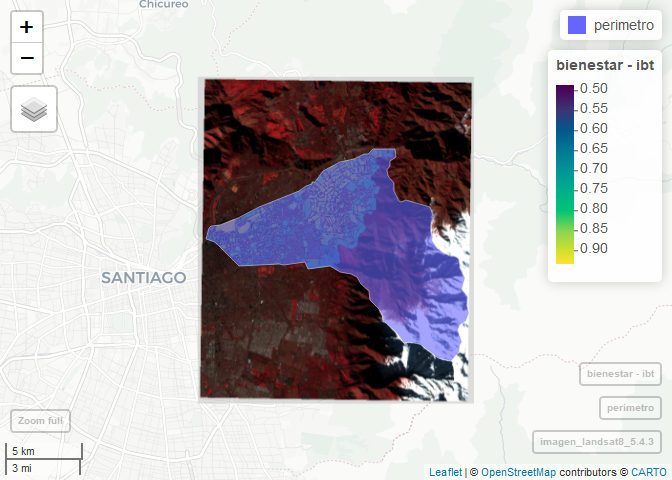

Las Condes
================

## Datos Geoespaciales

Este conjunto de datos fue preparado para enseñar tecnicas de
modelamiento territorial y analisis geoespacial. El lugar seleccionado
para este ejemplo es el municipio de Las Condes, en Santiago de Chile.
Las Condes es una comuna urbana y mas bien acomodada. En este conjunto
de datos se encuentra informacion geopolitica, fisica y sociodemografica
de este territorio.

## Limites politicos de Las Condes

Se decicio incluir en este conjunto de datos un Shapefile (\*.shp) ya
que es el formato de datos mas utilizados en el mundo de analisis de
datos geograficos vectoriales. El poligono corresponde al perimetro de
la comuna

``` r
perimetro <- sf::read_sf("data/shp/perimetro_lc.shp")

sf::st_crs(perimetro)
```

    ## Coordinate Reference System:
    ##   User input: WGS 84 / UTM zone 19S 
    ##   wkt:
    ## PROJCRS["WGS 84 / UTM zone 19S",
    ##     BASEGEOGCRS["WGS 84",
    ##         DATUM["World Geodetic System 1984",
    ##             ELLIPSOID["WGS 84",6378137,298.257223563,
    ##                 LENGTHUNIT["metre",1]]],
    ##         PRIMEM["Greenwich",0,
    ##             ANGLEUNIT["degree",0.0174532925199433]],
    ##         ID["EPSG",4326]],
    ##     CONVERSION["UTM zone 19S",
    ##         METHOD["Transverse Mercator",
    ##             ID["EPSG",9807]],
    ##         PARAMETER["Latitude of natural origin",0,
    ##             ANGLEUNIT["Degree",0.0174532925199433],
    ##             ID["EPSG",8801]],
    ##         PARAMETER["Longitude of natural origin",-69,
    ##             ANGLEUNIT["Degree",0.0174532925199433],
    ##             ID["EPSG",8802]],
    ##         PARAMETER["Scale factor at natural origin",0.9996,
    ##             SCALEUNIT["unity",1],
    ##             ID["EPSG",8805]],
    ##         PARAMETER["False easting",500000,
    ##             LENGTHUNIT["metre",1],
    ##             ID["EPSG",8806]],
    ##         PARAMETER["False northing",10000000,
    ##             LENGTHUNIT["metre",1],
    ##             ID["EPSG",8807]]],
    ##     CS[Cartesian,2],
    ##         AXIS["(E)",east,
    ##             ORDER[1],
    ##             LENGTHUNIT["metre",1]],
    ##         AXIS["(N)",north,
    ##             ORDER[2],
    ##             LENGTHUNIT["metre",1]],
    ##     ID["EPSG",32719]]

``` r
mapview::mapview(perimetro)
```

<!-- -->

## Datos sociodemograficos

Se incluye la informacion a nivel de manzana del censo y de los indices
de bienestar territorial.

``` r
censo <- readr::read_rds("data/censo.rds")

dplyr::glimpse(censo)
```

    ## Rows: 1,661
    ## Columns: 36
    ## $ ID_MANZ    <chr> "13114041001010", "13114041001012", "13114041001011", "1311…
    ## $ MANZ_EN    <chr> "URBANO", "URBANO", "URBANO", "URBANO", "URBANO", "URBANO",…
    ## $ NOM_COM    <chr> "LAS CONDES", "LAS CONDES", "LAS CONDES", "LAS CONDES", "LA…
    ## $ COD_COM    <dbl> 13114, 13114, 13114, 13114, 13114, 13114, 13114, 13114, 131…
    ## $ NOM_REG    <chr> "REGIÓN METROPOLITANA DE SANTIAGO", "REGIÓN METROPOLITANA D…
    ## $ COD_REG    <dbl> 13, 13, 13, 13, 13, 13, 13, 13, 13, 13, 13, 13, 13, 13, 13,…
    ## $ NOM_PROV   <chr> "SANTIAGO", "SANTIAGO", "SANTIAGO", "SANTIAGO", "SANTIAGO",…
    ## $ COD_PROV   <dbl> 131, 131, 131, 131, 131, 131, 131, 131, 131, 131, 131, 131,…
    ## $ ZONA       <chr> "13114041001", "13114041001", "13114041001", "13114041001",…
    ## $ ID_MANZCIT <chr> "13114041001010001", "13114041001012001", "1311404100101100…
    ## $ AREA       <dbl> 42265.212, 7981.996, 3695.021, 21129.365, 34241.578, 49762.…
    ## $ TOTAL_V    <dbl> 120, 5, 64, 16, 23, 41, 23, 15, 38, 6, 8, 473, 16, 10, 309,…
    ## $ HOG_N      <dbl> 105, 5, 57, 14, 23, 37, 20, 14, 32, 5, 8, 393, 14, 10, 262,…
    ## $ PERSONAS   <dbl> 300, 27, 128, 50, 98, 166, 80, 53, 153, 24, 31, 831, 54, 35…
    ## $ E4A18      <dbl> 56, 7, 24, 12, 10, 38, 17, 12, 26, 7, 7, 99, 12, 9, 99, 110…
    ## $ E15A24     <dbl> 51, 6, 19, 10, 33, 41, 16, 15, 31, 5, 6, 111, 10, 7, 91, 10…
    ## $ ESCOLAR    <dbl> 15.4, 17.4, 15.4, 17.1, 17.1, 17.3, 16.6, 16.4, 16.6, 17.2,…
    ## $ P03A_4     <dbl> 0, 0, 0, 0, 0, 0, 0, 0, 0, 0, 0, 0, 0, 0, 0, 0, 0, 0, 0, 0,…
    ## $ P03A_5     <dbl> 0, 0, 0, 0, 0, 0, 0, 0, 0, 0, 0, 0, 0, 0, 0, 0, 0, 0, 0, 0,…
    ## $ P03A_6     <dbl> 0, 0, 0, 0, 0, 0, 0, 0, 0, 0, 0, 0, 0, 0, 0, 0, 0, 0, 0, 0,…
    ## $ P03B_4     <dbl> 0, 0, 0, 0, 0, 0, 0, 0, 0, 0, 0, 0, 0, 0, 0, 0, 0, 0, 0, 0,…
    ## $ P03B_6     <dbl> 0, 0, 0, 0, 0, 0, 0, 0, 0, 0, 0, 0, 0, 0, 0, 0, 0, 0, 0, 0,…
    ## $ P03B_7     <dbl> 0, 0, 0, 0, 0, 0, 0, 0, 0, 0, 0, 0, 0, 0, 0, 0, 0, 0, 0, 0,…
    ## $ P03C_4     <dbl> 0, 0, 0, 0, 0, 0, 0, 0, 0, 0, 0, 0, 0, 0, 0, 0, 0, 0, 0, 0,…
    ## $ P03C_5     <dbl> 0, 0, 0, 0, 0, 0, 0, 0, 0, 0, 0, 0, 0, 0, 0, 0, 0, 0, 0, 0,…
    ## $ NIV_HAC2   <dbl> 2, 0, 0, 0, 0, 0, 0, 0, 0, 0, 0, 11, 0, 0, 4, 1, 0, 4, 0, 1…
    ## $ NIV_HAC3   <dbl> 0, 0, 0, 0, 0, 0, 0, 0, 0, 0, 0, 1, 0, 0, 0, 0, 0, 0, 0, 0,…
    ## $ HOMBRES    <dbl> 123, 13, 50, 22, 50, 81, 33, 25, 74, 11, 14, 387, 24, 12, 2…
    ## $ MUJERES    <dbl> 177, 14, 78, 28, 48, 85, 47, 28, 79, 13, 17, 444, 30, 23, 3…
    ## $ MONOPAR    <dbl> 15, 1, 16, 0, 2, 4, 2, 5, 3, 0, 0, 31, 0, 1, 14, 34, 16, 90…
    ## $ P17_ACT    <dbl> 170, 13, 69, 25, 45, 72, 42, 21, 82, 10, 16, 552, 24, 21, 3…
    ## $ P17_4      <dbl> 4, 0, 5, 0, 2, 7, 2, 1, 0, 0, 0, 14, 1, 0, 5, 15, 4, 37, 1,…
    ## $ J_NINI     <dbl> 2, 0, 5, 0, 1, 1, 0, 0, 1, 0, 0, 10, 0, 0, 0, 3, 3, 18, 0, …
    ## $ JH_HASTA_P <dbl> 3, 0, 1, 0, 0, 0, 0, 0, 1, 0, 0, 8, 0, 0, 5, 5, 0, 7, 0, 0,…
    ## $ JH_HASTA_S <dbl> 17, 0, 12, 0, 0, 3, 0, 1, 3, 0, 1, 34, 1, 4, 22, 31, 8, 88,…
    ## $ geometry   <POLYGON [m]> POLYGON ((360766.9 6306933,..., POLYGON ((360580.2 …

``` r
bienestar <- sf::read_sf("data/MBHT_lc.gpkg")

mapview::mapview(bienestar, zcol = "ibt")
```

<!-- -->

## Datos fisicos

Se incluyen imagenes satelitales multiespectrales de 30 metros de
resolucion, para los años 2013 al 2021.

``` r
imagen_landsat8 <- 
  stars::read_stars("data/imagenes/l8_2016.tif")
  
mapview::viewRGB(as(imagen_landsat8, "Raster") , r = 5, g = 4, b = 3, quantiles = c(0.05, .95))
```

<!-- -->

# Modelo de elevacion digital

Se incluye el modelo de elevacion digital del SRTM, con diferentes
resoluciones

``` r
dem <-   stars::read_stars("data/DEM/z12.tif")

mapview::mapview(dem)
```

<!-- -->

## Red Vial

Se incluye la red de calles de las condes, la cual viene como lineas

``` r
calles <- sf::read_sf("data/red_vial_LC.gpkg") 

mapview::mapview(calles) + 
  mapview::mapview(perimetro, color = "white", zcol = NULL )
```

<!-- -->

# Delitos

Por ultimo, se incluye un registro de los delitos comentidos en Las
Condes durante 2018, donde ademas de la ubicacion del suceso de indica
si fue robo o un hecho de violencia

``` r
delitos <- readr::read_rds("data/delitos_lc.rds")

mapview::mapview(delitos)
```

<!-- -->

Si apilamos las capas se puede ver que las imagenes tienen un area
superior a la extension de la comuna, y tambien se puede ver que mas de
la mitad del area de la comuna se encuentra en territorio de montaña,
por lo que no tiene poligonos de manzanas en su area

``` r
mapview::viewRGB(as(imagen_landsat8, "Raster") , r = 5, g = 4, b = 3, quantiles = c(0.05, .95)) +
  mapview::mapview(perimetro, color = "white", zcol = NULL ) +
  mapview::mapview(bienestar, zcol = "ibt")
```

<!-- -->
